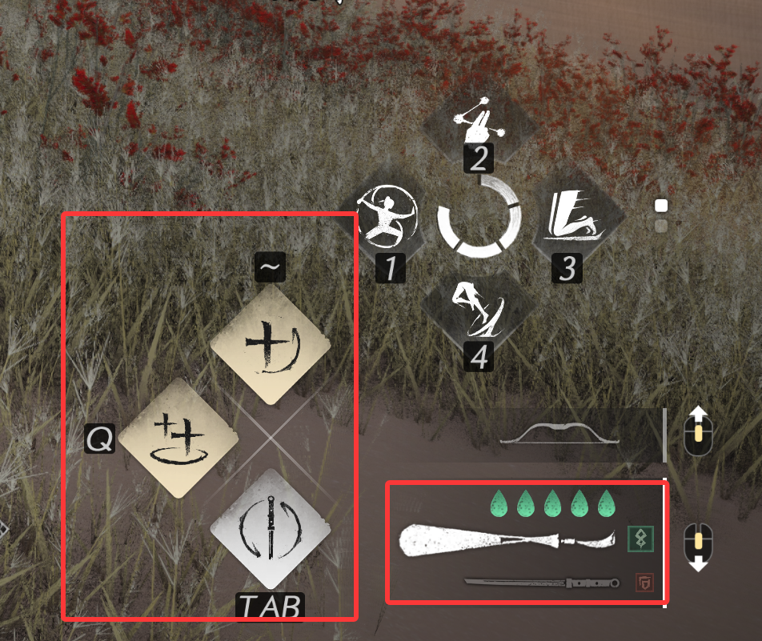
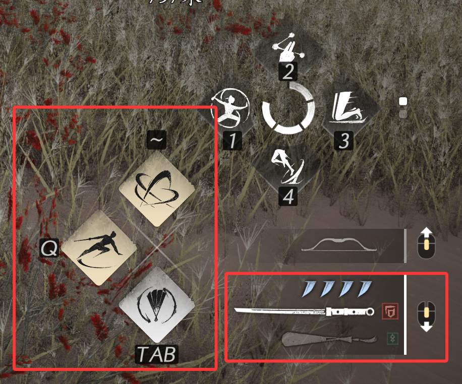
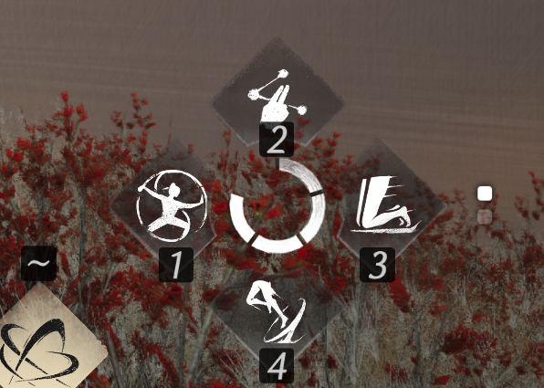
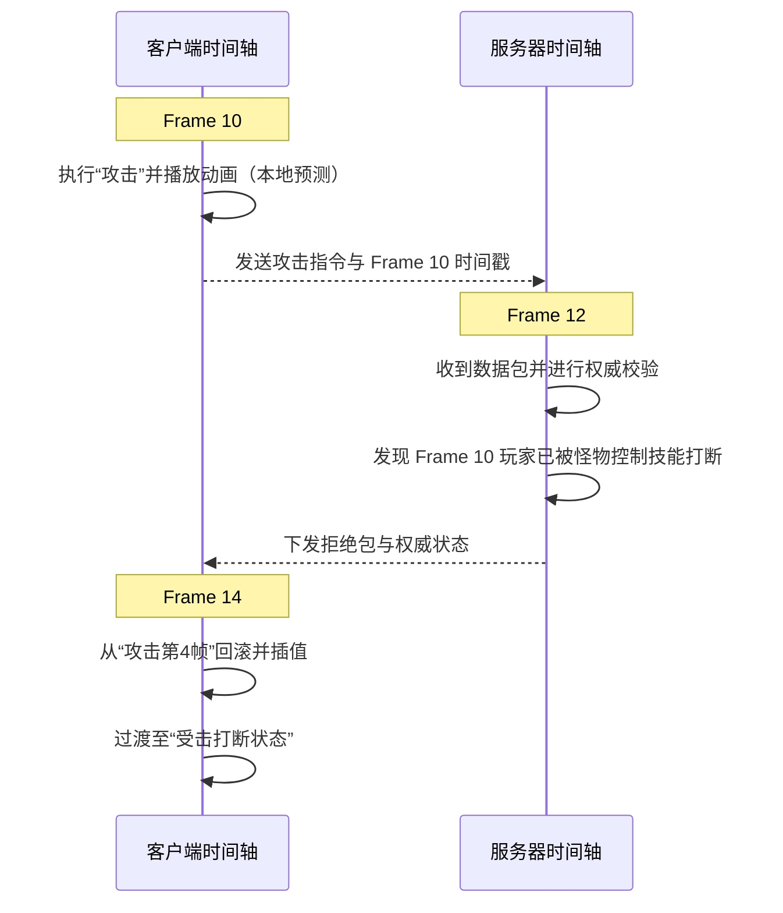

# 《燕云十六声核心系统技术拆解报告》

---

## 目录
1. **第一部分：剧情与对话系统拆解**
   * 1.1 系统对比分析（相比其他游戏）
   * 1.2 系统核心优点与缺点
   * 1.3 核心技术实现方案设计
2. **第二部分：战斗系统实现与多人同步方案（深度探究）**
   * 2.1 动作战斗系统的核心物理与判定
   * 2.2 多人战斗的同步方式（状态同步 vs 预测回退）
   * 2.3 战斗系统整体实现方案架构
3. **第三部分：动画系统组织结构与表现技术**
   * 3.1 动画系统的组织结构设计
   * 3.2 动画过渡、切换与融合表现
   * 3.3 系统优缺点对比评估
4. **第四部分：总结与见解**

---

## 第一部分：剧情与对话系统拆解

### 1.1 系统对比分析（相比其他游戏）
*   **对比对象**：《原神》（传统硬切式镜头对话）、《逆水寒手游》（AI实时生成与动态交互对话）。
*   **交互特征**：
    *   《燕云十六声》采取**无缝即时切入对话**，玩家在场景中靠近NPC触发对话时，不会经历传统黑屏（Fade-out / Fade-in）的生硬转场，而是将操作相机（Follow Camera）通过过渡轨道柔和推至对话镜头（Dialogue Camera）。

### 1.2 系统核心优点与缺点
*   **优点**：
    1.  **高沉浸无缝转场**：取消转场黑屏，镜头在运动中完成物理机位混合（Camera Blending），保持整体游戏节奏的连贯性。
    2.  **写实级面部与视线反馈**：NPC视线会合理追踪玩家，谈话过程中具有极强的人性化反馈。
*   **缺点**：
    1.  **内容生成成本高**：由于运镜和动作融合要求高，剧情对话更偏向高精度的“导演硬编码”，不具备类似AI驱动对话那种无限的动态生成边界和玩家自由对话输入空间。
    2.  **特定区域的镜头穿模**：在窄小空间（如洞穴、酒馆桌角）触发对话时，对话镜头由于物理射线碰撞自动推近，偶尔会产生局部穿模或突兀推近的问题。

### 1.3 核心技术实现方案设计
以下内容均基于游戏表现推测实现方法，非实际技术方案，仅供参考。
*   **编辑器设计**：基于图节点（Graph Node）的 **剧情流程行为树编辑器**。一个节点包含：配音触发（Audio Event）、摄像机轨导（Cinemachine Track）、角色表情状态（Face Blendshape）、分支选择。
*   **摄像机动态平滑混合算法**：
    *   采用 **Virtual Camera（虚拟相机）** 技术。在对话触发瞬间，生成两架虚拟相机（分别对焦玩家与NPC，呈对角过肩镜头 Over-the-shoulder Shots）。
    *   通过三阶贝塞尔曲线（Cubic Bezier Curve）在 0.5s 内将当前主相机的 FOV、位置和旋转无缝插值融合到虚拟相机。

---

## 第二部分：战斗系统实现与多人同步方案
### 2.0 战斗系统基础
以下内容均基于游戏表现推测实现方法，非实际技术方案，仅供参考。
* **健康系统**:
    *   **血量**：通过血条显示，受到敌人攻击时会扣除血量，血量归零时角色死亡
    *   **真气**：血条下方的蓝条，受到敌人攻击时会扣除真气，真气耗尽时角色会进入气竭状态，敌人可以处决造成较高伤害。同样敌人的真气耗尽时我们也能使用各种武器的处决技处决敌人
    *   **耐力**: 人物旁边的黄色弧状条，在使用闪避，武学和轻功时会消耗耐力，耐力耗尽后无法使用上述三种招式
* **动作系统**：
    *   **基础动作**：
        *   **普通攻击**: 连续点击普攻可以连续出招
        *   **重击**: 点按重击键（R），可以释放重击技能，大部分的武学都可以长按重击蓄力释放蓄力技
        *   **替换武器**: 在战斗中可以佩戴两种武器，按替换武器可以触发易武学，快速切换两种武器，衔接两种武器之间的武学连招
        *   **闪避**: 会消耗耐力
        *   **卸势**: 当敌人的攻击快要命中我们时，可以瞬间点按卸势(E)，能卸掉敌人的所有攻击，同时损耗敌人的真气值
        *   **格挡**: 可以格挡敌人攻击但只能规避部分伤害
*  **技能系统**：
    *   **武学**: 相当于武器绑定的技能，在战斗中可以佩戴两种武器，各自武学的冷却时间独立
    
    
    *   **奇术**: 
    
    
### 2.1 动作战斗系统的核心物理与判定
以下内容均基于游戏表现推测实现方法，非实际技术方案，仅供参考。
*   **分段细粒度碰撞体判定**：
    *   《燕云十六声》的打击判定不依赖简单的角色外层包围胶囊体（Capsule Collider），而是将身体划分骨骼组件，受击几何体随着角色当前的姿势进行变动。比如：在敌人失衡倒地时，如果玩家攻击从正前方掠过，无法造成伤害。


### 2.2 多人战斗的同步方式（状态同步 vs 预测回退）
为了在多人联机（中世界、副本、PVP）中既保障流畅的动作打击感，又防止外挂，系统采用了**带有时钟同步的“服务器权威状态同步（Client-side Prediction with Server Rollback）”**。

1.  **本地客户端（预测）**：玩家在本地按下攻击/化劲，客户端不等服务器应答，立即播放招式动作，计算并显示击中特效，保障动作反馈的 0 延迟。
2.  **服务器端（权威仲裁）**：服务器维持一个落后本地少许帧数的物理模拟世界。接收客户端打包带有高精度时间戳（Timestamp）的操作指令。
3.  **回退校准（Rollback）**：
    *   若服务器计算发现：在某一时间戳，怪物实际上已经先一步将玩家击晕，玩家本地的“化劲”不成立。
    *   服务器则下发强行同步状态，客户端强行回滚（Rollback）到该时间戳，重新模拟，将角色拉回至“受击被击退”状态，并利用运动插值在几帧内抚平拉扯感。



### 2.3 战斗系统整体实现方案架构
本战斗系统在逻辑上采用高度解耦的组件化架构：
*   **战斗输入拦截器（CombatInputBuffer）**：管理输入缓存，支持指令预输入（Input Buffering）。
*   **动作状态机（ActionStateManager）**：通过动画通知（AnimNotify）精确接收当前招式是否处于判定激活、闪避无敌帧等状态。
*   **碰撞与伤害裁决中心（HitValidationServer）**：位于服务器侧，进行安全与时序校验。
*   **状态与效果管理器（BuffEffectSystem）**：控制气血、气力值、霸体进度条及控制效果。

---

## 第三部分：动画系统组织结构与表现技术

### 3.1 动画系统的组织结构设计
系统基于 Messiah 引擎的动画控制框架，采用**分层状态机（Hierarchical State Machine）**与**全身/半身动画混合（Layered Bone Blend）**结构：

```
                    [ 动作表现总体管线 ]
                             │
            ┌────────────────┴────────────────┐
     [ 基础下半身位移 ]                 [ 战斗上半身动作 ]
   (静止/奔跑/起步/骤停)               (攻击/化劲/受击/施法)
             │                                 │
             └────────────────┬────────────────┘
                              │
                    [ 动画遮罩骨骼融合 ]
                     (Layered Blend)
                              │
                    [ 运动匹配 (Motion Matching) ]
                     (动态生成平滑过渡帧)
                              │
                    [ 地形自适应 (Slope IK) ]
                     (脚部贴地与关节纠偏)
                              │
                    [ 输出最终骨骼姿态 ]
```

### 3.2 动画过渡、切换与融合表现
*   **运动匹配技术（Motion Matching）**：
    *   传统游戏在奔跑突停、急转弯时会产生生硬的“滑步”或“动作硬切”。燕云在引擎中引入了运动匹配技术。系统实时监测角色的当前速度、加速度及未来轨迹方向，从数万帧的真人体捕武术动作库中，实时挑选并合成最符合物理特性的过渡帧，使角色急转、骤停等位移反馈具有极强的“重量感”与“惯性表现”。
*   **地形自适应与骨骼 IK（Inverse Kinematics）**：
    *   游戏在台阶、斜坡地形中表现极佳。通过脚部射线检测与两轴 **IK（逆向运动学）**，根据地面坡度动态调整角色小腿、大腿骨骼以及脚面倾斜角度，实现左右脚一高一低、脚掌紧贴斜坡的完美站姿。
*   **惯性插值（Inertialization）**：
    *   相比于传统的十字交叉融合（Cross-Fade）需要同时计算两段动画的开销，系统采用惯性插值，在动作突变（如攻击打断）时，只记录前一动作死亡瞬间的物理速度和位置，将其作为阻力计算到新动作的起始阶段，实现极低计算开销的顺滑过渡。

### 3.3 系统优缺点对比评估
*   **优点**：
    1.  **运动惯性极为写实**：由于 Motion Matching 与惯性插值（Inertialization）的结合，角色不论大步奔跑还是出招收势，其身体惯性展现逼真，彻底杜绝了传统武侠的“轻飘滑步”。
    2.  **地形拟真度极高**：双脚对陡坡和台阶的贴合极佳，几乎没有视觉悬空。
*   **不足**：
    1.  **极个别位置骨骼抖动（Joint Pop）**：在攀爬转换到站立、或在极复杂的碎石乱步区域，IK 在极短帧内可能出现物理约束超限，导致脚部关节瞬时抽搐（抖动现象）。
    2.  **网络同步下动作偶见微拉扯**：在多人高频瞬移、频繁打断的多人混战中，动作状态频繁同步可能在视觉上引发短促的动作不连贯。

---

## 第四部分：总结与见解

《燕云十六声》通过在**剧情**、**战斗**与**动画**三大系统的技术革新，将写实动作武侠游戏推向了一个新的表现高度。
*   剧情对话系统通过高精度过肩虚拟相机与视线追踪，构建了极其写实的影视化叙事；
*   战斗系统利用基于 UDP(KCP) 的服务器权威预测回退机制，在防作弊的前提下实现了单人ACT级的即时打击体验；
*   动画系统采用 Motion Matching 与骨骼 IK 双轮驱动，解决了硬核动作游戏中惯性丢失与斜坡穿模的顽疾。

这三个系统的紧密耦合和高度互补，是高品质、重操作物理对抗动作游戏开发不可或缺的核心技术基石。